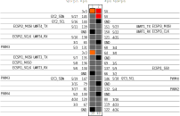

# picopi8m-ros-demos
Hybrid processor i.MX 8M has dedicated Cortex-M4 core for realtime peripheral processing.
This repository demonstrates how to use this core with Robotic Operating System.

## Distribution for minicomputer PICO-PI-IMX8M
Linux distribution for minicomputer can be built or downloaded from [picopi8m-ros-distbuild](https://github.com/trnila/picopi8m-ros-distbuild).
Distribution uses [modified](https://github.com/trnila/linux-tn) Linux kernel with remoteproc support for loading new code to the M4 core.
Each start of the M4 core reinitializes VirtIO structures for RPMsg communication.
M4 core is configured with memory protection unit, so it can't access or modify kernel memory.

## Running m4 code
M4 code uses MCUXpresso SDK with [created](https://github.com/trnila/picopi-m4sdk) CMake libraries for easier use.

Build and start M4 application with command `m4run` in source code of that example.
You can just build code with `m4build` or control core with `m4ctl`.

## PICO-PI-8M Pinout

