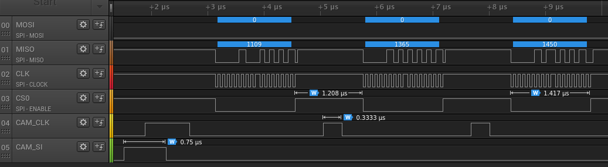
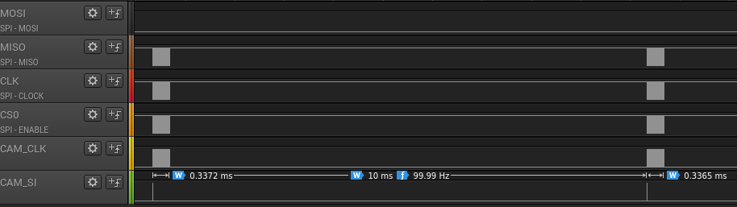
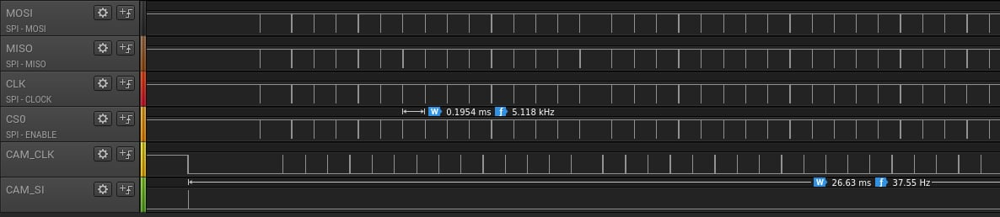
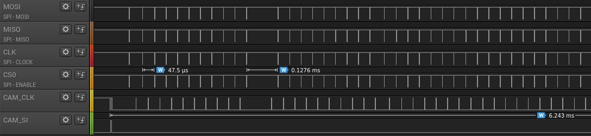
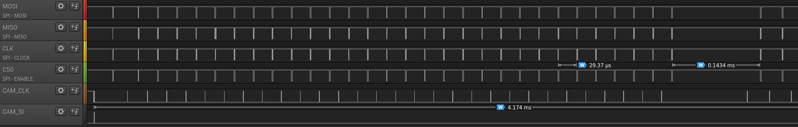

# linecam
Example shows how to measure data from analog linecam that is connected to picopi via SPI ADC128S102.
Linecam prepares first pixel of 128 on analog output when SI signal goes up with CLK clock.
That value is read from ADC.
Next pixel is prepared on following CLK pulse.
Whole row is then transmitted over rpmsg to the *rosserial_rpmsg/serial_node.py* node, which will deliver row to all subscribers of */linecam0* topic for further processing.

At first compile your ros workspace with `catkin_make` which is in *~/catkin_ws* by default.
Firmware for M4 core will be also built in this step.

Then you can load firmware, start *rosserial_rpmsg/serial_node.py* and *rosbridge* with single command:
```sh
$ roslaunch linecam app.launch
```
One of example subscribers is *display* showing measured data in shifting image.
```sh
$ rosrun linecam display
```


Another example may be `rosbridge_websocket`, that can bridge ros functionality with websocket, so it's possible to visualize measured data directly on web page as in *display.html* example.
Open it in your browser and optionally set some settings via URL fragment - *#server=picopi&zoom=1&topic=/linecam0*.

# linux /linecam0 publisher
In *src/linecam_linux.cpp* is userspace variant that is not capable of faster responses.
It tooks about 200 us between SPI transfers, but M4 is able to respond in 1.2 us.





Make sure you have booted with DTB *pico-8m-linecam.dtb* and have spidev module loaded, otherwise this example won't work.
Then you can run this example with `rosrun linecam linecam_linux`.

To archieve better response time, you can isolate fist core (to which most peripheral interrupts goes) from scheduler and then assign this process to this core.
Response time between SPI transfers will shorten from about 200 us to 45 us.
Boot with kernel parameter *isolcpus=0* and then assign process to that core with `taskset 1 nice -n-20 chrt --rr 99 rosrun linecam linecam_linux`.



# kernel /linecam0 publisher
Driver linecam in *kernel_module* is able to make measurement in about 10 ms.
When is that task isolated on core 0, it is able to shorten time to 4 ms, but still there are sometimes 143 us gaps - even with `taskset 1 nice -n-20 chrt --rr 99`.



Boot with *pico-8m-linecam-kernel.dtb* and optionally *isolcpus=0*.
Make sure you dont have spidev driver loaded.
Build kernel module, load it and start userspace application:
```sh
$ cd kernel_module
$ make
$ insmod ./linecam.ko
$ taskset 1 nice -n-20 chrt --rr 99 rosrun linecam linecam_kernel
```

## Ros recordings
Data on ros topics can be recorded and used for later debugging.
To recored data just run:
```sh
$ rosbag record --duration 5 -O captures/ros.bag /linecam0
```

Replay data with:
```sh
$ rosbag play captures/ros.bag
```
